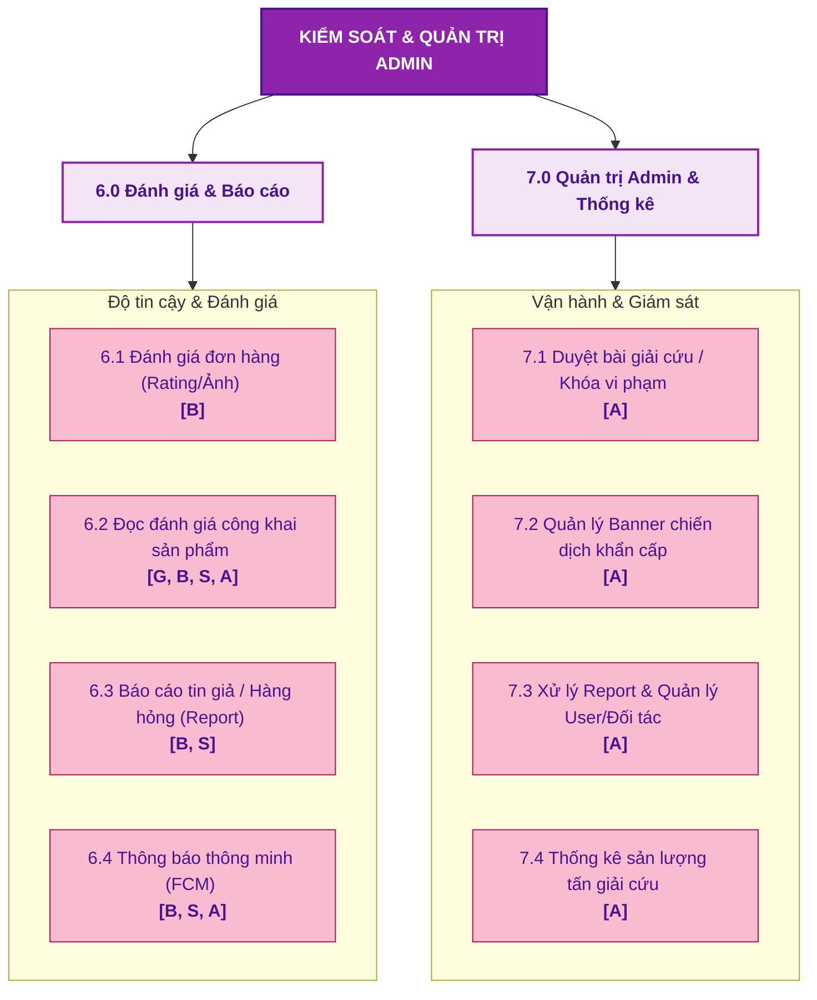

```mermaid
    flowchart TD
    ROOT_M67["KIỂM SOÁT & QUẢN TRỊ ADMIN"]:::headerClass

    M6["6.0 Đánh giá & Báo cáo"]:::parentClass
    M7["7.0 Quản trị Admin & Thống kê"]:::parentClass

    ROOT_M67 --> M6
    ROOT_M67 --> M7

    subgraph SUB_TRUST ["Độ tin cậy & Đánh giá"]
        F61["6.1 Đánh giá đơn hàng (Rating/Ảnh) <br/><b>[B]</b>"]
        F62["6.2 Đọc đánh giá công khai sản phẩm <br/><b>[G, B, S, A]</b>"]
        F63["6.3 Báo cáo tin giả / Hàng hỏng (Report) <br/><b>[B, S]</b>"]
        F64["6.4 Thông báo thông minh (FCM) <br/><b>[B, S, A]</b>"]
    end

    subgraph SUB_ADMIN ["Vận hành & Giám sát"]
        F71["7.1 Duyệt bài giải cứu / Khóa vi phạm <br/><b>[A]</b>"]
        F72["7.2 Quản lý Banner chiến dịch khẩn cấp <br/><b>[A]</b>"]
        F73["7.3 Xử lý Report & Quản lý User/Đối tác <br/><b>[A]</b>"]
        F74["7.4 Thống kê sản lượng tấn giải cứu <br/><b>[A]</b>"]
    end

    M6 --> SUB_TRUST
    M7 --> SUB_ADMIN

    classDef headerClass fill:#8E24AA,stroke:#4A148C,stroke-width:2px,color:#fff,font-weight:bold;
    classDef parentClass fill:#F3E5F5,stroke:#8E24AA,stroke-width:2px,color:#4A148C,font-weight:bold;
    classDef default fill:#F8BBD0,stroke:#AD1457,stroke-width:1px,color:#4A148C;
```
