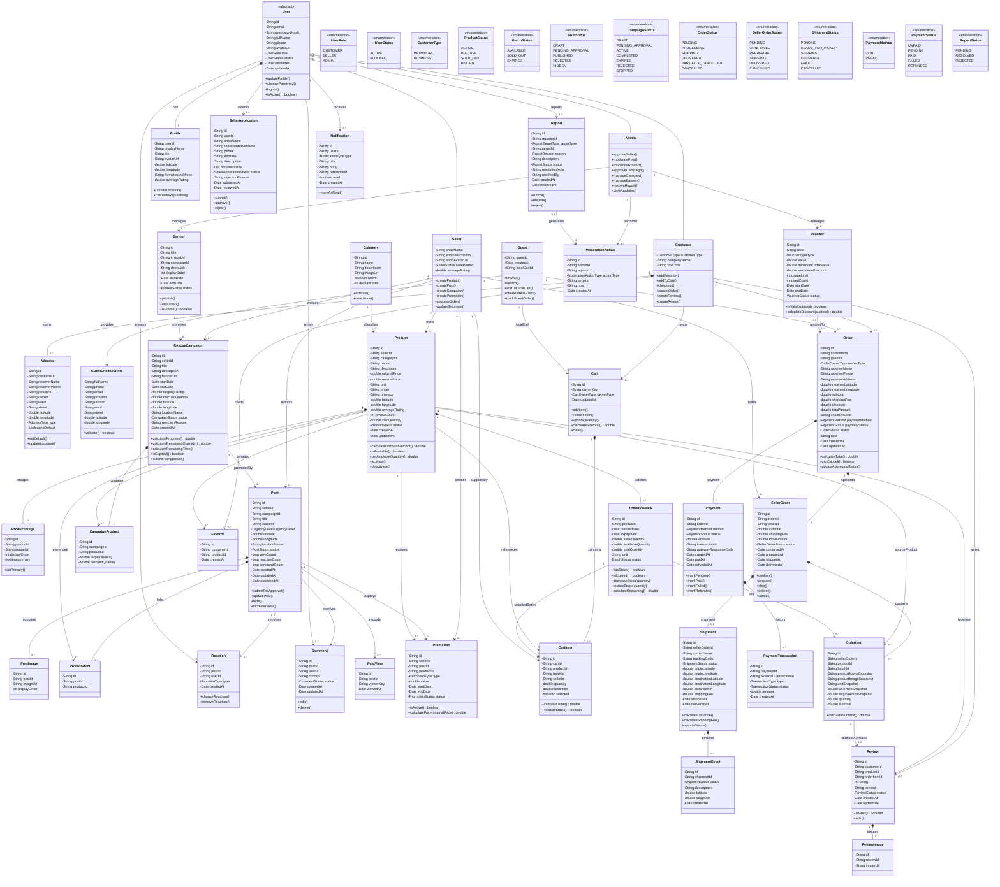

```mermaid
classDiagram

%% =========================================================
%% ACTORS / ACCOUNT
%% =========================================================

class Guest {
    +String guestId
    +Date createdAt
    +String localCartId
    +browse()
    +search()
    +addToLocalCart()
    +checkoutAsGuest()
    +trackGuestOrder()
}

class User {
    <<abstract>>
    -String id
    -String email
    -String passwordHash
    -String fullName
    -String phone
    -String avatarUrl
    -UserRole role
    -UserStatus status
    -Date createdAt
    -Date updatedAt
    +updateProfile()
    +changePassword()
    +logout()
    +isActive() boolean
}

class Customer {
    -CustomerType customerType
    -String companyName
    -String taxCode
    +addFavorite()
    +addToCart()
    +checkout()
    +cancelOrder()
    +createReview()
    +createReport()
}

class Seller {
    -String shopName
    -String shopDescription
    -String shopAvatarUrl
    -SellerStatus sellerStatus
    -double averageRating
    +createProduct()
    +createPost()
    +createCampaign()
    +createPromotion()
    +processOrder()
    +updateShipment()
}

class Admin {
    +approveSeller()
    +moderatePost()
    +moderateProduct()
    +approveCampaign()
    +manageCategory()
    +manageBanner()
    +resolveReport()
    +viewAnalytics()
}

User <|-- Customer
User <|-- Seller
User <|-- Admin

%% =========================================================
%% PROFILE / LOCATION / SELLER APPLICATION
%% =========================================================

class Profile {
    -String userId
    -String displayName
    -String bio
    -String avatarUrl
    -double latitude
    -double longitude
    -String formattedAddress
    -double averageRating
    +updateLocation()
    +calculateReputation()
}

class Address {
    -String id
    -String customerId
    -String receiverName
    -String receiverPhone
    -String province
    -String district
    -String ward
    -String street
    -double latitude
    -double longitude
    -AddressType type
    -boolean isDefault
    +setDefault()
    +updateLocation()
}

class GuestCheckoutInfo {
    -String fullName
    -String phone
    -String email
    -String province
    -String district
    -String ward
    -String street
    -double latitude
    -double longitude
    +validate() boolean
}

class SellerApplication {
    -String id
    -String userId
    -String shopName
    -String representativeName
    -String phone
    -String address
    -String description
    -List documentUrls
    -SellerApplicationStatus status
    -String rejectionReason
    -Date submittedAt
    -Date reviewedAt
    +submit()
    +approve()
    +reject()
}

User "1" *-- "1" Profile : has
Customer "1" *-- "0..*" Address : owns
User "1" --> "0..1" SellerApplication : submits
Guest --> GuestCheckoutInfo : provides

%% =========================================================
%% CATEGORY / PRODUCT / INVENTORY
%% =========================================================

class Category {
    -String id
    -String name
    -String description
    -String imageUrl
    -boolean active
    -int displayOrder
    +activate()
    +deactivate()
}

class Product {
    -String id
    -String sellerId
    -String categoryId
    -String name
    -String description
    -double originalPrice
    -double rescuePrice
    -String unit
    -String origin
    -String province
    -double latitude
    -double longitude
    -double averageRating
    -int reviewCount
    -double soldQuantity
    -ProductStatus status
    -Date createdAt
    -Date updatedAt
    +calculateDiscountPercent() double
    +isAvailable() boolean
    +getAvailableQuantity() double
    +activate()
    +deactivate()
}

class ProductImage {
    -String id
    -String productId
    -String imageUrl
    -int displayOrder
    -boolean primary
    +setPrimary()
}

class ProductBatch {
    -String id
    -String productId
    -Date harvestDate
    -Date expiryDate
    -double initialQuantity
    -double availableQuantity
    -double soldQuantity
    -String unit
    -BatchStatus status
    +hasStock() boolean
    +isExpired() boolean
    +decreaseStock(quantity)
    +restoreStock(quantity)
    +calculateRemaining() double
}

Seller "1" --> "0..*" Product : owns
Category "1" --> "0..*" Product : classifies
Product "1" *-- "1..*" ProductImage : images
Product "1" *-- "1..*" ProductBatch : batches

%% =========================================================
%% RESCUE CAMPAIGN / BANNER
%% =========================================================

class RescueCampaign {
    -String id
    -String sellerId
    -String title
    -String description
    -String bannerUrl
    -Date startDate
    -Date endDate
    -double targetQuantity
    -double rescuedQuantity
    -double latitude
    -double longitude
    -String locationName
    -CampaignStatus status
    -String rejectionReason
    -Date createdAt
    +calculateProgress() double
    +calculateRemainingQuantity() double
    +calculateRemainingTime()
    +isExpired() boolean
    +submitForApproval()
}

class CampaignProduct {
    -String id
    -String campaignId
    -String productId
    -double targetQuantity
    -double rescuedQuantity
}

class Banner {
    -String id
    -String title
    -String imageUrl
    -String campaignId
    -String deepLink
    -int displayOrder
    -Date startDate
    -Date endDate
    -BannerStatus status
    +publish()
    +unpublish()
    +isVisible() boolean
}

Seller "1" --> "0..*" RescueCampaign : creates
RescueCampaign "1" *-- "1..*" CampaignProduct : contains
Product "1" --> "0..*" CampaignProduct : participates
Admin "1" --> "0..*" Banner : manages
Banner "0..*" --> "0..1" RescueCampaign : promotes

%% =========================================================
%% COMMUNITY / POST
%% =========================================================

class Post {
    -String id
    -String sellerId
    -String campaignId
    -String title
    -String content
    -UrgencyLevel urgencyLevel
    -double latitude
    -double longitude
    -String locationName
    -PostStatus status
    -long viewCount
    -long reactionCount
    -long commentCount
    -Date createdAt
    -Date updatedAt
    -Date publishedAt
    +submitForApproval()
    +updatePost()
    +hide()
    +increaseView()
}

class PostImage {
    -String id
    -String postId
    -String imageUrl
    -int displayOrder
}

class PostProduct {
    -String id
    -String postId
    -String productId
}

class Reaction {
    -String id
    -String postId
    -String userId
    -ReactionType type
    -Date createdAt
    +changeReaction()
    +removeReaction()
}

class Comment {
    -String id
    -String postId
    -String userId
    -String content
    -CommentStatus status
    -Date createdAt
    -Date updatedAt
    +edit()
    +delete()
}

class PostView {
    -String id
    -String postId
    -String viewerKey
    -Date viewedAt
}

Seller "1" --> "0..*" Post : authors
Post "1" *-- "0..*" PostImage : contains
Post "1" *-- "0..*" PostProduct : links
Product "1" --> "0..*" PostProduct : referenced
RescueCampaign "0..1" --> "0..*" Post : promotedBy
Post "1" --> "0..*" Reaction : receives
User "1" --> "0..*" Reaction : creates
Post "1" --> "0..*" Comment : receives
User "1" --> "0..*" Comment : writes
Post "1" --> "0..*" PostView : records

%% =========================================================
%% PROMOTION / VOUCHER
%% =========================================================

class Promotion {
    -String id
    -String sellerId
    -String postId
    -String productId
    -PromotionType type
    -double value
    -Date startDate
    -Date endDate
    -PromotionStatus status
    +isActive() boolean
    +calculatePrice(originalPrice) double
}

class Voucher {
    -String id
    -String code
    -VoucherType type
    -double value
    -double minimumOrderValue
    -double maximumDiscount
    -int usageLimit
    -int usedCount
    -Date startDate
    -Date endDate
    -VoucherStatus status
    +isValid(subtotal) boolean
    +calculateDiscount(subtotal) double
}

Seller "1" --> "0..*" Promotion : creates
Post "0..1" --> "0..1" Promotion : displays
Product "1" --> "0..*" Promotion : receives
Admin "1" --> "0..*" Voucher : manages

%% =========================================================
%% FAVORITE / CART
%% =========================================================

class Favorite {
    -String id
    -String customerId
    -String productId
    -Date createdAt
}

class Cart {
    -String id
    -String ownerKey
    -CartOwnerType ownerType
    -Date updatedAt
    +addItem()
    +removeItem()
    +updateQuantity()
    +calculateSubtotal() double
    +clear()
}

class CartItem {
    -String id
    -String cartId
    -String productId
    -String batchId
    -String sellerId
    -double quantity
    -double unitPrice
    -boolean selected
    +calculateTotal() double
    +validateStock() boolean
}

Customer "1" --> "0..*" Favorite : owns
Product "1" --> "0..*" Favorite : favorited
Customer "1" --> "0..1" Cart : owns
Guest "1" --> "0..1" Cart : localCart
Cart "1" *-- "0..*" CartItem : contains
Product "1" --> "0..*" CartItem : references
ProductBatch "1" --> "0..*" CartItem : selectedBatch
Seller "1" --> "0..*" CartItem : suppliedBy

%% =========================================================
%% ORDER - MULTI VENDOR
%% =========================================================

class Order {
    -String id
    -String customerId
    -String guestId
    -OrderOwnerType ownerType
    -String receiverName
    -String receiverPhone
    -String receiverAddress
    -double receiverLatitude
    -double receiverLongitude
    -double subtotal
    -double shippingFee
    -double discount
    -double totalAmount
    -String voucherCode
    -PaymentMethod paymentMethod
    -PaymentStatus paymentStatus
    -OrderStatus status
    -String note
    -Date createdAt
    -Date updatedAt
    +calculateTotal() double
    +canCancel() boolean
    +updateAggregateStatus()
}

class SellerOrder {
    -String id
    -String orderId
    -String sellerId
    -double subtotal
    -double shippingFee
    -double totalAmount
    -SellerOrderStatus status
    -Date confirmedAt
    -Date preparedAt
    -Date shippedAt
    -Date deliveredAt
    +confirm()
    +prepare()
    +ship()
    +deliver()
    +cancel()
}

class OrderItem {
    -String id
    -String sellerOrderId
    -String productId
    -String batchId
    -String productNameSnapshot
    -String productImageSnapshot
    -String unitSnapshot
    -double unitPriceSnapshot
    -double originalPriceSnapshot
    -double quantity
    -double subtotal
    +calculateSubtotal() double
}

Customer "1" --> "0..*" Order : places
Guest "1" --> "0..*" Order : places
Order "1" *-- "1..*" SellerOrder : splitsInto
Seller "1" --> "0..*" SellerOrder : fulfills
SellerOrder "1" *-- "1..*" OrderItem : contains
Product "1" --> "0..*" OrderItem : sourceProduct
ProductBatch "1" --> "0..*" OrderItem : sourceBatch
Voucher "0..1" --> "0..*" Order : appliedTo

%% =========================================================
%% PAYMENT / TRANSACTION HISTORY
%% =========================================================

class Payment {
    -String id
    -String orderId
    -PaymentMethod method
    -PaymentStatus status
    -double amount
    -String transactionId
    -String gatewayResponseCode
    -Date createdAt
    -Date paidAt
    -Date refundedAt
    +markPending()
    +markPaid()
    +markFailed()
    +markRefunded()
}

class PaymentTransaction {
    -String id
    -String paymentId
    -String externalTransactionId
    -TransactionType type
    -TransactionStatus status
    -double amount
    -Date createdAt
}

Order "1" *-- "1" Payment : payment
Payment "1" *-- "1..*" PaymentTransaction : history

%% =========================================================
%% SHIPPING / GPS
%% =========================================================

class Shipment {
    -String id
    -String sellerOrderId
    -String carrierName
    -String trackingCode
    -ShipmentStatus status
    -double originLatitude
    -double originLongitude
    -double destinationLatitude
    -double destinationLongitude
    -double distanceKm
    -double shippingFee
    -Date shippedAt
    -Date deliveredAt
    +calculateDistance()
    +calculateShippingFee()
    +updateStatus()
}

class ShipmentEvent {
    -String id
    -String shipmentId
    -ShipmentStatus status
    -String description
    -double latitude
    -double longitude
    -Date createdAt
}

SellerOrder "1" *-- "0..1" Shipment : shipment
Shipment "1" *-- "0..*" ShipmentEvent : timeline

%% =========================================================
%% REVIEW
%% =========================================================

class Review {
    -String id
    -String customerId
    -String productId
    -String orderItemId
    -int rating
    -String content
    -ReviewStatus status
    -Date createdAt
    -Date updatedAt
    +isValid() boolean
    +edit()
}

class ReviewImage {
    -String id
    -String reviewId
    -String imageUrl
}

Customer "1" --> "0..*" Review : writes
Product "1" --> "0..*" Review : receives
OrderItem "1" --> "0..1" Review : verifiesPurchase
Review "1" *-- "0..*" ReviewImage : images

%% =========================================================
%% REPORT / MODERATION
%% =========================================================

class Report {
    -String id
    -String reporterId
    -ReportTargetType targetType
    -String targetId
    -ReportReason reason
    -String description
    -ReportStatus status
    -String resolutionNote
    -String resolvedBy
    -Date createdAt
    -Date resolvedAt
    +submit()
    +resolve()
    +reject()
}

class ModerationAction {
    -String id
    -String adminId
    -String reportId
    -ModerationActionType actionType
    -String targetId
    -String note
    -Date createdAt
}

User "1" --> "0..*" Report : reports
Admin "1" --> "0..*" ModerationAction : performs
Report "0..1" --> "0..*" ModerationAction : generates

%% =========================================================
%% NOTIFICATION
%% =========================================================

class Notification {
    -String id
    -String userId
    -NotificationType type
    -String title
    -String body
    -String referenceId
    -boolean read
    -Date createdAt
    +markAsRead()
}

User "1" --> "0..*" Notification : receives

%% =========================================================
%% ENUMERATIONS
%% =========================================================

class UserRole {
    <<enumeration>>
    CUSTOMER
    SELLER
    ADMIN
}

class UserStatus {
    <<enumeration>>
    ACTIVE
    BLOCKED
}

class CustomerType {
    <<enumeration>>
    INDIVIDUAL
    BUSINESS
}

class ProductStatus {
    <<enumeration>>
    ACTIVE
    INACTIVE
    SOLD_OUT
    HIDDEN
}

class BatchStatus {
    <<enumeration>>
    AVAILABLE
    SOLD_OUT
    EXPIRED
}

class PostStatus {
    <<enumeration>>
    DRAFT
    PENDING_APPROVAL
    PUBLISHED
    REJECTED
    HIDDEN
}

class CampaignStatus {
    <<enumeration>>
    DRAFT
    PENDING_APPROVAL
    ACTIVE
    COMPLETED
    EXPIRED
    REJECTED
    STOPPED
}

class OrderStatus {
    <<enumeration>>
    PENDING
    PROCESSING
    SHIPPING
    DELIVERED
    PARTIALLY_CANCELLED
    CANCELLED
}

class SellerOrderStatus {
    <<enumeration>>
    PENDING
    CONFIRMED
    PREPARING
    SHIPPING
    DELIVERED
    CANCELLED
}

class ShipmentStatus {
    <<enumeration>>
    PENDING
    READY_FOR_PICKUP
    SHIPPING
    DELIVERED
    FAILED
    CANCELLED
}

class PaymentMethod {
    <<enumeration>>
    COD
    VNPAY
}

class PaymentStatus {
    <<enumeration>>
    UNPAID
    PENDING
    PAID
    FAILED
    REFUNDED
}

class ReportStatus {
    <<enumeration>>
    PENDING
    RESOLVED
    REJECTED
}
```
